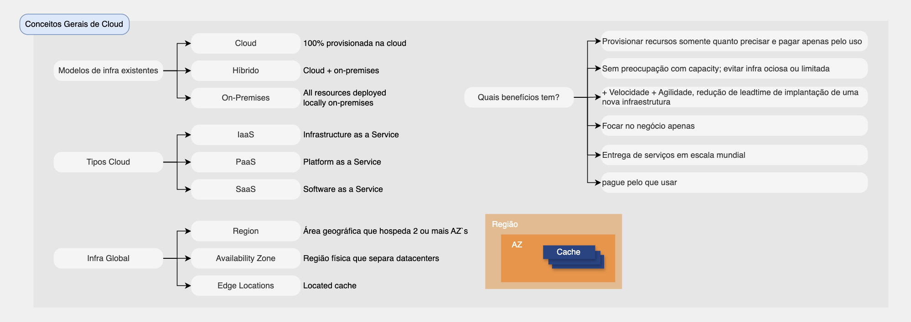

# Computação em nuvem

# Índice

* [O que é computação em nuvem?](#o-que-é-computação-em-nuvem)
* [Cinco características da computação em nuvem](#cinco-características-da-computação-em-nuvem)
* [EC2](#ec2)
* [ECS](#ecs)
* [EKS](#eks)
* [ECR](#ecr)
* [AWS Fargate](#aws-fargate)
* [AWS Lambda](#aws-lambda)
* [Amazon lightsail](#amazon-lightsail)
* [AWS Step Functions](#aws-step-functions)
* [AWS Outposts](#aws-outposts)
* [AWS Elastic Beanstalk](#aws-elastic-beanstalk)
* [AWS Wavelength](#aws-wavelength)
* [Importância por alta disponibilidade e dimensionsamento](#importância-por-alta-disponibilidade-e-dimensionsamento)
* [Resumo sobre os serviços](#resumo-sobre-os-serviços)
* [Perguntas Frequentes](#perguntas-frequentes)

## O que é computação em nuvem?

A computação em nuvem é o fornecimento sob demanda de recursos e aplicações de TI pela internet com o modelo de pagamento conforme o uso.

### Os modelos de implantação da nuvem

| Nuvem privada | Nuvem pública | Nuvem híbrida |
|----------|----------|----------|
| Serviçcos em nuvem usados por uma única organização não exportos ao público    | Recursos de nuvem pertencentes e operados por um provedor de serviços de nuvem terceirizado, entregues pela internet   | Servidores locais e estenção de recursos para a nuvem   |

### Cinco características da computação em nuvem

* Autoatendimento sob demanda
* Amplo acesso à rede
* Multilocação de recursos
* Elasticidade e escalabilidade rápidas
* Serviço medido: usuários pagam pelo que usam

## EC2
- Serviço computacional-padrão da AWS.
- As instâncias do Amazon EC2 são máquinas virtuais e as instâncias do EC2 são executadas em hosts do EC2, que são o hardware ou servidores físicos que a AWS gerencia.

Instâncias:
| Instância | Descrição |
|----------|----------|
| T3 | Uso geral |
| R5a | Otimizada para memória |
| C5 | Otimizada para computação |
| F1 | Computação acelerada |
| T3 | Otimizada para armazenamento |
| AMI | AMI |

## ECS

- Amazon Elastic Container Service
- Serviço que aceita containers com instruções sobre onde e como executá-los.

## EKS
- Elastic Kubernets Service
- Simplifica a execução de Kubernetes na AWS

## ECR
- Elastic Container Registry
- Permite armazenar e implantar imagens de containers

## AWS Fargate
- Permite executar containers sem servidor.
- Serviço para implantar ECS e EKS serveless.
- [Documentação AWS](https://aws.amazon.com/pt/fargate/)

## AWS Lambda

- Função como serviço
- Aceita funções
- Orientado por eventos
- Ser servidor

## Amazon lightsail

- plataforma em nuvem fácil de usar que oferece tudo o necessário para construir um aplicativo ou website, além de um plano mensal econômico.
- Lightsail é a maneira mais simples para a empresa estabelecer um website na AWS.

## AWS Step Functions

- serviço da AWS que é projetado para ajudar os usuários a orquestrar um processo de fluxo de trabalho para um conjunto de funções AWS Lambda
- este serviço permite coordenar múltiplos serviços AWS em workflows serverless que podem ser acionados por eventos.

## AWS Outposts

- Oferece infra e serviços da AWS no local, permitindo a execução de cargas de trabalho na nuvem em data centers locas.

## AWS Elastic Beanstalk
- Permite instalar aplicações e serviços web sem servidor

## AWS Wavelength
- Permite que os desenvolvedores criem aplicativos que oferecem latências ultrabaixas para dispositivos móveis e usuários finais.

## Importância por alta disponibilidade e dimensionsamento

- Auto Scalling:
- ELB (Elastic Load Balancer): distribui conexões de entrada em um grupo de servidores

## Resumo sobre os serviços

# Perguntas Frequentes:

Qual serviço você pode usar para provisionar um servidor pré-configurado com pouca ou nenhuma experiência em AWS?
Resp: O Amazon LightSail fornece aos desenvolvedores poder de computação, armazenamento e rede para implantar e gerenciar sites, aplicações web e bancos de dados na nuvem. LightSail fornece servidores virtuais privados (instâncias) pré-configurados que incluem tudo o que é necessário para implantar e aplicar ou criar um banco de dados. A implantação de um servidor no LightSail é extremamente fácil e não requer conhecimento de como configurar VPCs, grupos de segurança, ACLs de rede, etc.

[ Home](../README.md)