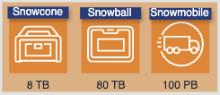
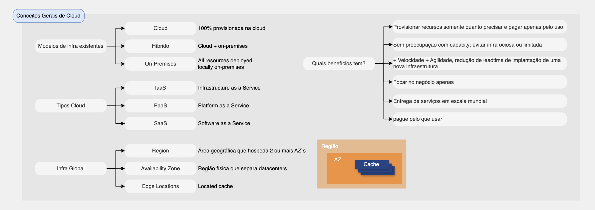

# Storage

# Índice

* [Armazenamento](#armazenamento)
    - [Opções de armazenamento da AWS](#opções-de-armazenamento-da-aws)
        - [Armazenamento de objetos](#armazenamento-de-objetos)
            - [Amazon S3](#amazon-s3)
        - [Armazenamento de arquivos](#armazenamento-de-arquivos)
            - [Amazon EFS](#amazon-efs)
            - [Amazon FSx](#amazon-fsx)
        - [Armazenamento de blocos](#armazenamento-de-blocos)
            - [Amazon EBS](#amazon-ebs)
            - [Sistema de arquivos em cache da AWS](#sistema-de-arquivos-em-cache-da-aws)
            - [AWS Storage Gateway](#aws-storage-gateway)
* [Migração e transferência](#migração-e-transferência)
    - [AWS Database Migration Service](#aws-database-migration-service)
    - [Family AWS Snow](#family-aws-snow)
    - [Amazon S3 Transfer Acceleration](#amazon-s3-transfer-acceleration)
    - [AWS DataSync](#aws-datasync)
* Resumo sobre os serviços
* Links de documentação
* Perguntas Frequentes

# Armazenamento

## Opções de armazenamento da AWS
1. Objeto
2. Arquivo
3. Bloco

### Armazenamento de objetos

## Amazon S3
| Tipo | Descrição |
|----------|----------|
| S3 Standard |  |
| S3 Intelligent-Tiering | Otimizada para memória |
| S3 Standard - Infrequent Access (IA) | Otimizada para computação |
| S3 One Zone - IA | Computação acelerada |
| S3 Glacier | Otimizada para armazenamento |
| S3 Glacier Deep Archive | Storage class de menor custo e suporta retenção de longo prazo e os dados podem ser restaurados em 12 horas. |

### Armazenamento de arquivos

## Amazon EFS

- Elastic File System
- Armazenamento de arquivos elástico e sem servidor

## Amazon FSx
- Armazenamento de arquivos para Lustre, Windows

### Armazenamento de blocos

## Amazon EBS
- Elastic Block Store
- Armazenamento de bloco para uso em instância EC2 (SSD - Solid State Disk e HDD - Hard Disk Drive)

### Sistema de arquivos em cache da AWS

### AWS Storage Gateway
- Serviço que nos permite conectar nosso armazenamento de data center on-premises a um serviço de armazenamento da AWS e ajuda a migrar parte ou toda a sua plataforma de armazenamento para AWS ou oferece suporte à extensão de sua plataforma de armazenamento para AWS.
- Produto que você baixa e configura em seu local on-premises e se comunica com a AWS pela internet.
- 3 tipos:
    - File Gateway: armazena objetvos no s3 com um cache local on-premises
    - Volume Gateway: Volumes armazenados no gateway e volumes em cache no gateway
    - Fita virtual: unidades de fitas virtuais para o s3

# Migração e transferência

## Migração - Como transferir dados para a nuvem?

### AWS Database Migration Service
Facilita a migração de banco de dados para AWS

### Family AWS Snow
Dispositivos físicos projetados para transferir grandes quantidades de dados de forma offline

### Amazon S3 Transfer Acceleration
Transferir grandes quantidades de dados para o S3 de forma rápida e segura

### AWS DataSync
- Transferência automatizada entre sistemas de arquivos locais e o S3, EFS ou FSx
- Útil para migração de dados em massa e backup

## Resumo sobre os serviços

# Links de documentação
[Migração e transferência](https://docs.aws.amazon.com/pt_br/whitepapers/latest/aws-overview/migration-services.html)

# Perguntas Frequentes

Qual serviço de armazenamento permite conectar várias instâncias do EC2 simultaneamente usando protocolos em nível de arquivo? Qual serviço da AWS permite conectar-se ao armazenamento de servidores locais usando protocolos de arquivo padrão?
Resp: Amazon EFS - Amazon Elastic File System permite conectar centenas ou milhares de instâncias EC2 simultaneamente e é acessado usando o protocolo NFS em nível de arquivo.

Uma empresa armazena cópias de backups no Amazon S3 e exige acesso rápido, mas com baixa resiliência. Qual classe de armazenamento é otimizada para esses requisitos?
Resp: O S3 One Zone-IA destina-se a dados acessados ​​com menos frequência, mas que exigem acesso rápido quando necessário. Ao contrário de outras classes de armazenamento S3 que armazenam dados em no mínimo três zonas de disponibilidade (AZs), o S3 One Zone-IA armazena dados em uma única AZ e custa 20% menos que o S3 Standard-IA. O S3 One Zone-IA é ideal para clientes que desejam uma opção de custo mais baixo para dados acessados ​​com pouca frequência, mas não exigem a disponibilidade e a resiliência do S3 Standard ou do S3 Standard-IA. É uma boa opção para armazenar cópias de backup secundárias de dados locais ou dados facilmente recriáveis. Você também pode usá-lo como armazenamento econômico para dados replicados de outra região da AWS usando a replicação entre regiões do S3.

Qual tecnologia de armazenamento AWS pode ser considerada um “disco rígido virtual na nuvem”?
Resp: Um volume EBS é um dispositivo de armazenamento em bloco que é mais semelhante a um disco rígido virtual na nuvem, pois quando conectado a uma instância ele aparece como um disco local que pode ter um sistema operacional instalado ou ser formatado e usado para qualquer outro finalidade de armazenamento local.

Um profissional de nuvem precisa decidir qual classe de armazenamento do Amazon S3 usar para armazenar cópias de dados de backup. O armazenamento deve fornecer acesso rápido quando necessário, mas a resiliência pode ser baixa. Qual classe de armazenamento é mais adequada?
Resp: S3 One Zone-IA é para dados que são acessados ​​com menos frequência, mas requerem acesso rápido quando necessário. Ao contrário de outras classes de armazenamento S3 que armazenam dados em no mínimo três zonas de disponibilidade (AZs), o S3 One Zone-IA armazena dados em uma única AZ e custa 20% menos que o S3 Standard-IA.

[ Home](../README.md)