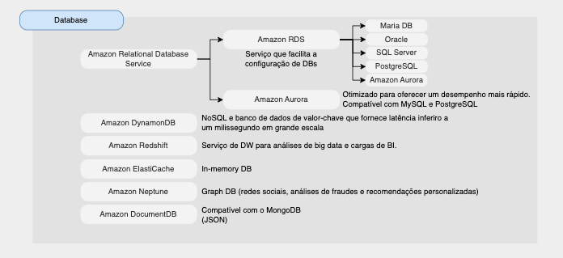

# Database

# Índice

* [Amazon RDS (Amazon Relational Database Service)](#amazon-rds-amazon-relational-database-service)
* [Amazon Aurora](#amazon-aurora)
* [Amazon ElastiCache](#amazon-elasticache)
* [Amazon DynamoDB](#amazon-dynamodb)
* [Amazon Redshift](#amazon-redshift)
* [Amazon Neptune](#amazon-neptune)
* [Amazon DocumentDB](#amazon-documentdb)
* [Migração de banco de dados](#migração-de-banco-de-dados)
- [SnowFamily](#aws-snow-family)
- [DMS](#aws-database-migration-service-dms)
- [AWS DataSync](#aws-datasync)
- [Resumo sobre os serviços](#resumo-sobre-os-serviços)

## Amazon RDS (Amazon Relational Database Service)

* RDS = Relational Database Service
* É um serviço de banco de dados gerenciado para uso de banco de dados SQL como linguagem de consulta.
* Permite criar bancos de dados na nuvem gerenciados pela AWS:
    - Postgres
    - MySQL
    - Maria DB
    - Oracle
    - SQL Server
    - Aurora (database prórpio da AWS)

## Amazon Aurora

* Aurora é uma tecnologia proprietária da AWS (não de código aberto)
* Otimizado para oferecer um desempenho mais rápido.
* Compatível com MySQL e PostgreSQL
* Aurora é “otimizado para nuvem AWS” e afirma melhoria de desempenho 5x em relação ao MySQL no RDS, mais de 3x o desempenho do Postgres no RDS
* Aurora custa mais que RDS (20% mais) – mas é mais eficiente
* Não está no nível gratuito

## Amazon ElastiCache

* *In-memory* DB
* Caches são bancos de dados na memória com alto desempenho e baixa latência
* Ajuda a reduzir a carga de banco de dados que tem um uso itenso de leitura
* Redis e Memcached
* Armazenamento de estados de sessão

## Amazon DynamoDB

* Banco de dados NoSQL
* Banco de dados de valor-chave que fornece latência inferior a um milissegundo em grande escala
* Alta disponibilidade com replicação em 3 AZs
* Integrado com IAM para segurança, autorização e administração

## Amazon Redshift

* Serviço de DW para análises de big data e cargas de BI
* Baseado em um PostgreSQL, mas não é usado para OLTP (Online Transactional Processing)
* É OLAP – processamento analítico online (análise e armazenamento de dados)
* Baseado em coluna
* Pague conforme o uso com base nas instâncias provisionadas
* Possui interface SQL para realizar as consultas
* Ferramentas de BI como AWS Quicksight ou Tableau integram-se a ele

## Amazon Neptune

* Graph DB (redes sociais, análises de fraudes e recomendações personalizadas)
* Um conjunto de dados gráficos popular seria uma rede social
    - Os usuários têm amigos
    - Postagens têm comentários
    - Os comentários têm curtidas dos usuários
    - Os usuários compartilham e gostam de postagens…
* Exemplo: Wikipédia

## Amazon DocumentDB

* Compatível com o MongoDB (JSON) - NoSQL DB
* Altamente disponível com replicação em 3 AZ

### Migração de banco de dados

## AWS Snow Family
- Serviço para migrar grandes quantidades de dados dentro e fora da AWS.
- São uma coleção de dispositivos físicos que ajudam a migrar grandes quantidades de dados para dentro e para fora da nivem sem depender de redes.

* AWS Snowcone
* AWS Snowball
* AWS Snowmobile

## AWS Database Migration Service (DMS)

* DMS = Database Migration Service
* É o serviço que faz a migração de banco de dados
* Pode migrar bancos de dados do mesmo tipo (ex: De Oracle para Oracle), ou de tipos diferentes (ex: de Oracle para Aurora).
* O banco de dados de origem fica disponível durante toda a migração.

## AWS Schema Conversion Tool (SCT)

## AWS DataSync
- Facilita e agiliza a movimentação de grandes quantidades de dados on-line entre  armazenamento on-premises e o Amazon S3, Amazon EFS ou Amazon FSx para Windows File Service.
- Lida automaticamente com muitas das tarefas, incluindo scripts de tarefas de cópia, agendamento e monitoramento de transferências, validação de dados e otimização da utilização da rede, e pode transferir centenas de terabytes e milhões de arquivos em velocidade até 10 vezes maiores do que ferramentas de código aberto, pela internet ou por links do AWS Direct Connect.

## Resumo sobre os serviços

[ Home](../README.md)