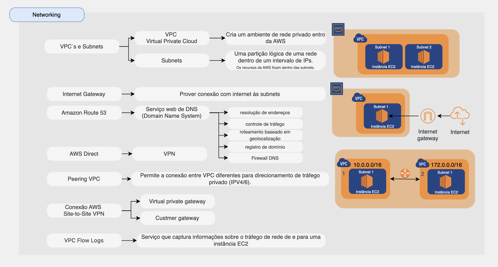

# Networking

## Introdução a networking

A AWS oferece serviços de network.
Alguns recursos de databases são:

* [VPC](#vpc)

## VPC

## Gateway NAT

## Peering de VPC

## VPN

## AWS Direct Connect

## Amazon Route 53
- Sistema de nomes de domínio (DNS)
- Registro de domínios e hospedagem de zonas

Qual é o escopo de uma VPC em uma região?
Resp: abrange todas as zonas de disponibilidade globalmente

## Resumo sobre os serviços da AWS de Networking

[ Home](../README.md)