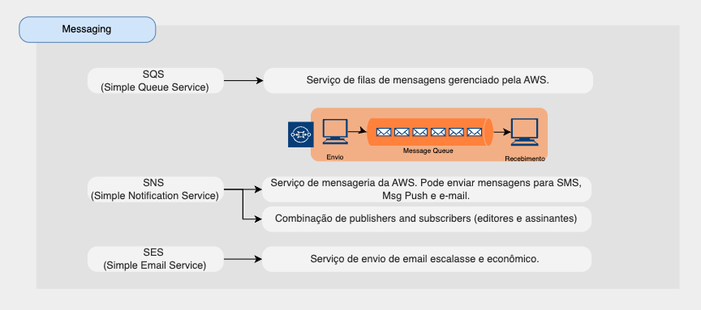

# Messaging

Alguns recursos de mensageria são:

* [SQS (Simples Queue Service)](#sqs)
* [SNS (Simple Notification Service)](#sns)
* [SES (Simple Email Service)](#amazon-quicksight)

## SQS

* Serviço de filas simples de mensagens gerenciado pela AWS.
* Serviço totalmente gerenciado (~sem servidor), usado para desacoplar aplicativos.
* Não há limite de mensagend na fila.
* queue model

## SNS

* Serviço de mensageria da AWS (notificação). Pode enviar mensagens para SMS, Msg Push e e-mail.
* Combinação de publisers and subscribers (editores e assinantes)
* Pub/sub model
* Assinantes: Email, Lambda, SQS, HTTP, Mobile…
* Sem retenção de mensagens

## SES

* Serviço de envio de email escalasse e econômico.

## Resumo sobre os serviços da AWS de mensageria

[ Home](../README.md)