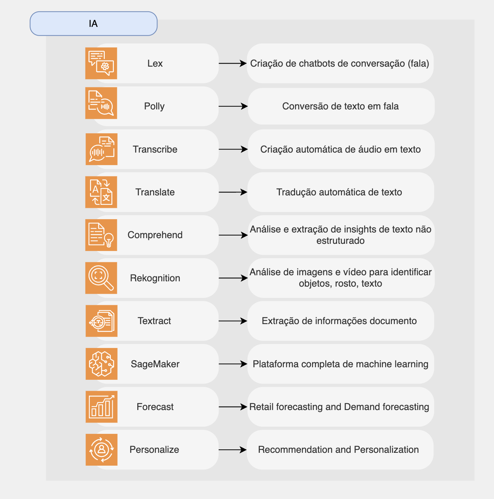

# Machine Learning

# Índice

Abaixo segue uma planilha com os serviços da AWS de IA:
- Amazon Lex
- Amazon Polly
- Amazon Transcribe
- Amazon Translate
- Amazon Comprehend
- Amazon Rekognition
- Amazon Textract
- Amazon SageMaker
- Amazon Forecast
- Amazon Personalize
- Amazon Kendra
- AWS DeepLens
- AWS DeepRacer
- Amazon Fraud Detector
- Amazon Monitron
- Amazon CodeGuru

## Resumo sobre os serviços da AWS de IA

| Serviços | Descrição |
|----------|----------|
| Lex | Cria chatbot de conversação |
| Polly | Texto em áudio |
| Transcribe | áudio para texto (ex: legendas) |
| Translate | Tradução |
| Comprehend | processamento de linguagem natural |
| Rekognition | detecção de rosto, rotulagem, reconhecimento de celebridades |
| Textract | Extração de texto em documentos |
| SageMaker | aprendizado de máquina para todos os desenvolvedores e cientistas de dados |
| Forecast | crie previsões altamente precisas |
| Personalize | recomendações personalizadas em tempo real |
| Amazon Kendra | Serviço de pesquisa, desenvolvido por machine learning, que capacita os usuários a pesquisar textos não estruturados usando linguagem natural. |
| AWS DeepLens | Câmera de vídeo habilitada para deep learning para desenvolver e implantar modelos de visão computacional na borda. |
| AWS DeepRacer | Plataforma de corrida de carros autônomos em miniatura para aprender reinforcement learning. |
| Amazon Fraud Detector | Serviço totalmente gerenciado que usa ML e mais de 20 anos de experiência em detecção de fraudes da Amazon para identificar atividades potencialmente fraudulentas |
| Amazon Monitron | Serviço para detectar comportamentos anormais em máquinas industriais |
| CodeGuru | recomendações para melhorar o código |
| CodeWhisperer | sugestão para escrever código mais rápido |
| Macie | descobrir e proteger dados sensíveis |

## Resumo sobre os serviços

[ Home](../README.md)