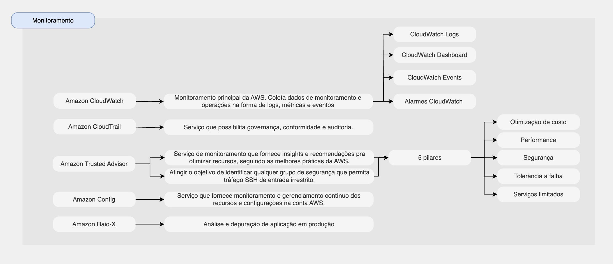

# Monitoramento

Alguns recursos de analytics são:

* [Amazon Cloudwatch](#amazon-cloudwatch)
* [Amazon CloudTrail](#amazon-cloudtrail)
* [Amazon Trusted Advisor](#amazon-trusted-advisor)
* [Amazon Config](#amazon-config)
* [AWS Raio-X](#amazon-raiox)

## Amazon Cloudwatch

* Monitoramento principal da AWS.
* CloudWatch fornece métricas para todos os serviços na AWS.
* Coleta dados de monitoramento e operações na forma de logs, métricas e eventos.
* Métrica é uma variável a ser monitorada (CPUUtilization, NetworkIn, etc.)
* 4 recursos do CloudWatch:
    1. CloudWatch Logs
        - Coletar logs
    2. CloudWatch Dashboards
        - Monitore o desempenho dos serviços AWS e métricas de faturamento por meio de gráficos
    3. CloudWatch Events
        - Scripts agendados a partir de regras em uma programação
    4. Alarmes CloudWatch
        - Os alarmes são usados ​​para acionar notificações para qualquer métrica

## Amazon CloudTrail

* Serviço que possibilita governança, conformidade e auditoria.
* Habilitado por padrão!
* Obtenha um histórico de eventos/chamadas de API feitas em sua conta AWS (Console, SDK, CLI, Serviços AWS)
* CloudTrail Insights: análise automatizada de seus eventos CloudTrail
* Se um recurso for excluído na AWS, investigue primeiro o CloudTrail!

## Amazon Trusted Advisor

* Serviço de monitoramento que fornece insights e recomendações pra otimizar recursos, seguindo as melhores práticas da AWS.
* Atingir o objetivo de identificar qualquer grupo de segurança que permita tráfego SSH de entrada irrestrito.
* 5 pilares:
    1. Otimização de custo
    2. Performance
    3. Segurança
    4. Tolerância a falhas
    5. Serviços limitados

## Amazon Config

* Serviço que fornece monitoramento e gerenciamento contínuo dos recursos e configurações na conta AWS.

## AWS Raio-X

* Sistema de rastreamento distribuído.
    - Teste localmente
    - Adicione instruções de log em qualquer lugar
    - Reimplantar na produção
* Analise e depure aplicações de produção e distribuídas.
* Link documentação: [AWS xray](https://aws.amazon.com/pt/xray/)

## Resumo sobre os serviços da AWS de Monitoramento

[ Home](../README.md)