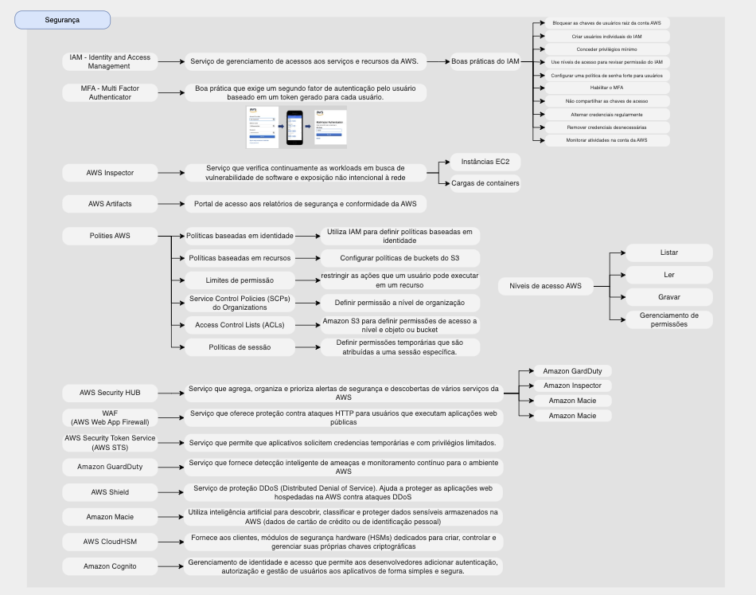

# Segurança

# Índice

* [Segurnaça e conformidade](#segurnaça-e-conformidade)
* [Serviços de segurança da AWS](#serviços-de-segurança-da-aws)
    - [AWS Inspector](#aws-inspector)
    - [AWS Security HUB](#aws-security-hub)
    - [AWS WAF (AWS Web App Firewall)](#aws-waf-aws-web-app-firewall)
    - [Amazon GuardDuty](#amazon-guardduty)
    - [AWS Shield](#aws-shield)
    - [Amazon Macie](#amazon-macie)
    - [AWS CloudHSM](#aws-cloudhsm)
    - [Amazon Cognito](#amazon-cognito)
    - [AWS Artifact](#aws-artifact)
    - [Criptografia](#criptografia)
* [Gerenciamento de acessos da AWS](#gerenciamento-de-acessos-da-aws)
    - [IAM - Identity and Access Management](#iam---identity-and-access-management)
    - [MFA - Multi Factor Authenticator](#mfa---multi-factor-authenticator)
    - [Usuário-raiz da conta da AWS](#usuário-raiz-da-conta-da-aws)
    - [AWS Simple Token Service (AWS STS)](#aws-simple-token-service-aws-sts)
* [Resumo sobre os serviços de segurança](#resumo-sobre-os-serviços-de-segurança)

## Segurnaça e conformidade
- Entender o modelo de responsabilidade compartilhada da AWS
- Definir os conceitos de segurnaça, governança e conformidade da nuvem AWS
- Identificar os recursos de gerenciamento de acessos da AWS
- Identificar os componentes e recursos de segurança
- Segurança em todas as camadas
- Integrar serviçcos de segurança
- Proteger conexões

## Serviços de segurança da AWS

Link da documentação: [Documentação de segurança da AWS](https://docs.aws.amazon.com/pt_br/security/)

### AWS Inspector
- Serviço que verifica continuamente as workloads em busca de vulnerabilidade de software e exposição não intencional à rede
    - Instâncias EC2
    - Cargas de containers
- Serviço que podem fornecer recomendações sobre segurança.
- Serviço que juda a melhorar a segurança e conformidade das aplicações.

### AWS Security HUB
- Serviço que agrega, organiza e prioriza alertas de segurança e descobertas de vários serviços da AWS

### AWS WAF (AWS Web App Firewall)
- AWS Web App Firewall que oferece proteção contra ataques HTTP para usuários que executam aplicações web públicas
- AWS WAF ajuda a controlar o tráfego com regras definidas que bloqueiam padrões de ataque comuns.
- Proteger o site contra injeção de SQL ou scripting entre sites.
- O AWS WAF é um firewall de aplicação web que ajuda a proteger aplicativos web contra exploits comuns que podem afetar a disponibilidade, comprometer a segurança ou consumir recursos excessivos.
- serviço que permite **implementar condições personalizadas para filtrar e controlar o tráfego web de entrada.**

### Amazon GuardDuty
- serviço de detecção de ameaças que monitora a existência de atividade mal-itencionada e comportamento não autorizado.

### AWS Shield
- Serviço de proteção DDoS (Distributed Denial of Service). Ajuda a proteger as aplicações web hospedadas na AWS contra ataques DDoS.
- serviços da AWS são projetados para proteger uma carga de trabalho **contra injeções de SQL, cross-site scripting e ataques DDoS.**

### Amazon Macie
- Utiliza inteligência artificial para descobrir, classificar e proteger dados sensíveis armazenados na AWS (dados de cartão de crédito ou de identificação pessoal)

### AWS CloudHSM
- Fornece aos clientes, módulos de segurança hardware (HSMs) dedicados para criar, controlar e gerenciar suas próprias chaves criptográficas

### Amazon Cognito
- Gerenciamento de identidade e acesso que permite aos desenvolvedores adicionar autenticação, autorização e gestão de usuários aos aplicativos de forma simples e segura.

### AWS Artifact
- serviço que fornece acesso sob demanda a relatórios de segurança e conformidade da AWS e acordos online da AWS.

## Criptografia
- Outra forma de proteger o dado
- Criptografar dados em repouso: dados armazenados
- Criptografar dados em trânsito

## Gerenciamento de acessos da AWS

### IAM - Identity and Access Management
- Serviço de gerenciamento de acessos aos serviços e recursos da AWS.
- Boas práticas do IAM:
    - Bloquear as chaves de usuários raiz da conta AWS
    - Criar usuários individuais do IAM
    - Conceder privilégios mínimo
    - Use níveis de acesso para revisar permissão do IAM
    - Configurar uma política de senha forte para usuários
    - Habilitar o MFA
    - Não compartilhar as chaves de acesso
    - Alternar credenciais regularmente
    - Remover credenciais desnecessárias
    - Monitorar atividades na conta da AWS

Link da documentação:
[O que é o IAM Identify Center?](https://docs.aws.amazon.com/pt_br/singlesignon/latest/userguide/what-is.html)
[Identidades do IAM (usuários, grupos de usuários e funções)](https://docs.aws.amazon.com/pt_br/IAM/latest/UserGuide/id.html)

### MFA - Multi Factor Authenticator
- Boa prática que exige um segundo fator de autenticação pelo usuário baseado em um token gerado para cada usuário.

### Usuário-raiz da conta da AWS
- O root-user tem completo e irrestrito acesso a todos os recursos em uma conta da AWS.
    - Gerenciar configurações da conta
    - Restaurar permissões de usuário do IAM
    - Ativas o acesso do IAM ao console de gerenciamento e faturamento
    - Ver faturas de impostos
    - Fechar sua conta da AWS
    - Registrar como um vendedor
    - COnfigurar o s3 com MFA
    - Editar ou excluir as políticas de bucket do S3
    - Cadastrar na AWS GovCloud
    - Solicitar chaves de acesso para o usuário-raiz da conta da AWS GovCloud
- não é recomendado usar o root-user em atividades diárias

### AWS Simple Token Service (AWS STS)
- serviço da AWS é usado para fornecer temporariamente credenciais de segurança federadas para um usuário ou aplicação
- Este serviço permite aos clientes solicitarem credenciais temporárias com privilégios limitados para usuários IAM ou usuários autenticados (usuários federados).

## Resumo sobre os serviços de segurança

[ Home](../README.md)