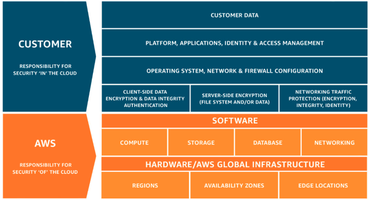

# Modelo de Responsabilidade Compartilhada

* Customer/Cliente: Responsabilidade pela segurança **na** nuvem
* AWS: Responsabilidade pela segurnaça **da** nuvem

## Customer/Cliente

A responsabilidade do cliente será determinada pelos Serviços de nuvem AWS selecionados por ele. Isso determina a quantidade de operações de configuração que o cliente deverá executar como parte de suas responsabilidades de segurança.

* Os clientes da AWS são responsáveis por habilitar a criptografia de dados em repouso para o Amazon Elastic Block Store (Amazon EBS).
* Administração e monitoramento de usuários IAM, grupos, roles e policies
* Gerenciamento de MFA nas contas

## AWS

A AWS é responsável por proteger a infraestrutura que executa todos os serviços oferecidos na Nuvem AWS (hardware, software, redes e instalações).

* Infra
* Fornece segurança física para recursos de computação
* Configuração e análise de vulnerabilidade
* Validação de compliance
* A AWS é responsável pela desativação de dispositivos de armazenamento subjacentes em fim de vida útil usados para hospedar dados na AWS.
* AWS é responsável pelo Infraestutura global de hardwares (regiões, zonas de disponibilidade, locais de borda)
* Realizar patches e manutenção da infraestrutura.
* Assegurar o acesso físico às instalações da AWS.

[ Home](../README.md)