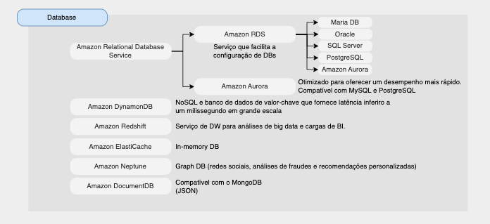

# Database

## Introdução a banco de dados

A AWS oferece serviços de banco de dados relacionais e não-relacionais.
Alguns recursos de databases são:

    * Amazon RDS (Amazon Relational Database Service)
    * Amazon Aurora
    * Amazon ElastiCache
    * Amazon DynamoDB
    * Amazon Redshift
    * Amazon Neptune
    * Amazon DocumentDB
    * DMS (Database Migration Service)

### Amazon RDS (Amazon Relational Database Service)

* RDS = Relational Database Service
* É um serviço de banco de dados gerenciado para uso de banco de dados SQL como linguagem de consulta.
* Permite criar bancos de dados na nuvem gerenciados pela AWS:
    - Postgres
    - MySQL
    - Maria DB
    - Oracle
    - SQL Server
    - Aurora (database prórpio da AWS)

### Amazon Aurora

* Aurora é uma tecnologia proprietária da AWS (não de código aberto)
* Otimizado para oferecer um desempenho mais rápido.
* Compatível com MySQL e PostgreSQL
* Aurora é “otimizado para nuvem AWS” e afirma melhoria de desempenho 5x em relação ao MySQL no RDS, mais de 3x o desempenho do Postgres no RDS
* Aurora custa mais que RDS (20% mais) – mas é mais eficiente
* Não está no nível gratuito

### Amazon ElastiCache

* *In-memory* DB
* Caches são bancos de dados na memória com alto desempenho e baixa latência
* Ajuda a reduzir a carga de banco de dados que tem um uso itenso de leitura

### Amazon DynamoDB

* Banco de dados NoSQL
* Banco de dados de valor-chave que fornece latência inferior a um milissegundo em grande escala
* Alta disponibilidade com replicação em 3 AZs
* Integrado com IAM para segurança, autorização e administração

### Amazon Redshift

* Serviço de DW para análises de big data e cargas de BI
* Baseado em um PostgreSQL, mas não é usado para OLTP (Online Transactional Processing)
* É OLAP – processamento analítico online (análise e armazenamento de dados)
* Pague conforme o uso com base nas instâncias provisionadas
* Possui interface SQL para realizar as consultas
* Ferramentas de BI como AWS Quicksight ou Tableau integram-se a ele

### Amazon Neptune

* Graph DB (redes sociais, análises de fraudes e recomendações personalizadas)
* Um conjunto de dados gráficos popular seria uma rede social
    - Os usuários têm amigos
    - Postagens têm comentários
    - Os comentários têm curtidas dos usuários
    - Os usuários compartilham e gostam de postagens…
* Exemplo: Wikipédia

### Amazon DocumentDB

* Compatível com o MongoDB (JSON) - NoSQL DB
* Altamente disponível com replicação em 3 AZ

### DMS

* DMS = Database Migration Service
* É o serviço que faz a migração de banco de dados
* Pode migrar bancos de dados do mesmo tipo (ex: De Oracle para Oracle), ou de tipos diferentes (ex: de Oracle para Aurora).
* O banco de dados de origem fica disponível durante toda a migração.

## Resumo sobre os serviços da AWS de banco de dados

[ Home](../README.md)