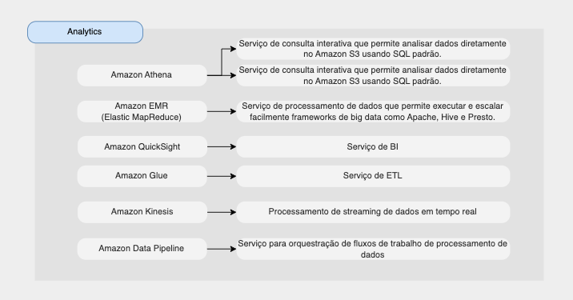

# Analytics

Alguns recursos de analytics são:

* [Amazon Athena](#amazon-athena)
* [Amazon EMR (Elastic MapReduce)](#amazon-emr)
* [Amazon QuickSight](#amazon-quicksight)
* [Amazon Glue](#amazon-glue)
* [Amazon Kinesis](#amazon-kinesis)
* [Amazon Data Pipeline](#amazon-data-pipeline)

## Amazon Athena

* Serviço de consulta interativa que permite analisar dados diretamente no Amazon S3
* Usa linguagem SQL padrão para consultar os arquivos
* Suporta CSV, JSON, ORC, Avro e Parquet (construído em Presto)
* Principal caso de uso: **análise de dados no S3 usando SQL sem servidor**
* Casos de uso: inteligência de negócios/análises/relatórios, análise e consulta de logs de fluxo de VPC, logs ELB, trilhas CloudTrail, etc...

[https://athena/](https://aws.amazon.com/pt/athena/)

## Amazon EMR (Elastic MapReduce)

* EMR = Elastic MapReduce
* EMR ajuda a criar Hadoop (BigData) para analisar e processar uma grande quantidade de dados
* Serviço de processamento de dados que permite executar e escalar facilmente frameworks de big data como Apache, Hive e Presto.

## Amazon QuickSight

* Serviço de BI sem servidor para criar painéis interativos
* Casos de uso:
    - Business analytics
    - Construindo visualizações
    - Execute análises ad-hoc
    - Insights de negócios usando dados
* Integrado com RDS, Aurora, Athena, Redshift, S3…

## Amazon Glue

* Serviço de ETL
* Útil para preparar e transformar dados para análise
* Serviço totalmente sem servidor
* Pode ser usado por Athena, Redshift, EMR

## Amazon Kinesis

* Processamento de streaming de dados em tempo real
* Serviço gerenciado para coletar, processar e analisar dados de streaming em tempo real em qualquer escala

## Amazon Data Pipeline

* Serviço para orquestração de fluxos de trabalho de processamento de dados

## Resumo sobre os serviços da AWS de analytics

[ Home](../README.md)