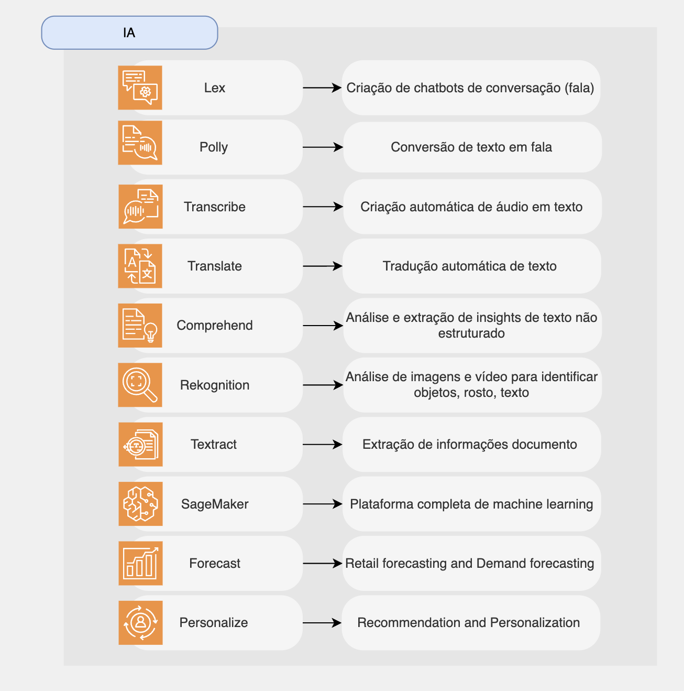

# Machine Learning

## Serviços AWS existestes

* [Amazon Lex](#amazon-lex)
* Amazon Polly
* Amazon Transcribe
* Amazon Translate
* Amazon Comprehend
* Amazon Rekognition
* Amazon Textract
* Amazon SageMaker
* Amazon Forecast
* Amazon Personalize

### Amazon Lex
### Amazon Polly
### Amazon Transcribe
### Amazon Translate
### Amazon Comprehend
### Amazon Rekognition
### Amazon Textract
### Amazon SageMaker
### Amazon Forecast
### Amazon Personalize

## Resumo sobre os serviços da AWS de banco de dados

* Lex: crie bots conversacionais – chatbot
* Polly: texto para áudio
* Transcribe: áudio para texto (ex: legendas)
* Translate: traduções
* Comprehend: processamento de linguagem natural
* Rekognition: detecção de rosto, rotulagem, reconhecimento de celebridades
* Textract: detecte texto e dados em documentos
* SageMaker: aprendizado de máquina para todos os desenvolvedores e cientistas de dados
* Forecast: crie previsões altamente precisas
* Personalize: recomendações personalizadas em tempo real

[ List](../README.md)