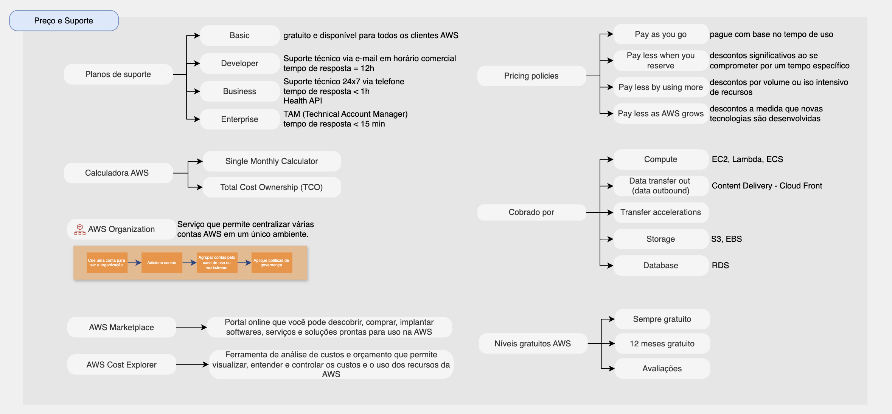

# Preço e suporte

Alguns recursos sobre billing e suporte da AWS:

* [AWS Organizations](#aws-organization)
* [AWS Control Tower](#aws-control-tower)
* [Modelos de preços na AWS](#Modelos-de-precos-na-aws)
* [AWS Billing](#aws-billing)
* [AWS Saving Plans](#aws-saving-plans)
* [AWS Ferramentas Billing](#aws-ferramentas-billing)
    - [AWS Calculadora](#aws-calculadora)
    - [Dashboards de faturamento](Dashboard-de-faturamento)
    - [Tags de custo e reports](tags-de-custo-e-reports)
    - [AWS Cost Explorer](aws-cost-explorer)
    - [AWS Marketplace](aws-marketplace)
* [AWS Suporte Plan](#aws-suporte-plan)

## AWS Organizations

* Serviço global
* Serviço que permite centralizar várias contas AWS em um único ambiente.
* The main account is the master account.
* Vantagens para o faturamento consolidado:
    - Consolidação de todas as contas e um método de pagamento único
    - Desconto por volume utilizado (benefício de uso agregado)
    - Agrupamento de instâncias reservadas do EC2 para economia ideal
* Restringir privilégios de conta usando políticas de controle de serviço (Service Control Policies - SCP)

Crie uma conta para ser a organização > Adicione contas > Agrupar contas pelo caso de uso ou workstream > Aplique políticas de governança

## AWS Control Tower

* Maneira fácil de configurar e controlar um ambiente AWS multicontas seguro e compatível com base nas práticas recomendadas
* Benefícios:
    - Configure um ambiente de várias contas rapidamente
    - Automação e governança integrada usando guardrails
    - Controles pré-configurados
    - Integre softwares de terceiros em grande escala
* AWS Control Tower é executado em AWS Organization e integra automaticamente o Organization para organizar as contas e implementar as políticas de controle de serviço (SCPs).

## Modelos de preços na AWS

A AWS tem 4 políticas de preço:

| Política de preço | Descrição |
|----------|----------|
| AWS Basic Support Plan | Gratuito | Gratuito e disponível para todos os clientes AWS |
| 1. Pay as you go | Pague com base no tempo de uso |
| 2. Pay less when you reserve | Descontos significativos ao se comprometer por um tempo específico |
| 3. Pay less by using more | Descontos por volume ou iso intensivo de recursos |
| 4. Pay less as AWS grows | Descontos a medida que novas tecnologias são desenvolvidas |

## AWS Billing

A AWS tem três fundamentos de precificação, seguindo o modelo de precificação:
1. Compute (EC2, Lambda e ECS)
2. Storage (S3, EBS)
3. Data transfer out (Content Delivery - CloudFront by Number of HTTP/HTTPS requests)
4. Database (RDS)
5. Transfer accelerations

## AWS Saving Plans

* Níveis gratuitos AWS (serviços que são 100% gratuitos, 12 meses grauitos e por avaliações)
* Instâncias reservadas por 1 ou 3 anos (compromissos de longo prazo na AWS)

## AWS Ferramentas Billing

### Calculadora AWS

* Ferramentas de faturamento e custos para estimar o custo na nuvem.
* Disponível em [https://calculator.aws/](https://calculator.aws/)
* Single Monthly Calculator
    - Serviço em que você diz qual serviço da AWS você pretende usar e como você pretende usar e ele diz o quanto que isso irá te custar nos próximos 12 meses.
* Total Cost Ownership (TCO)
    - é usada para ajudar a reduzir custos fazendo cálculos no modelo pay-as-you-go.

### Dashboards de faturamento

* É possível ver os gastos no mês atual, você pode ver o gasto geral ou os gastos por produto.

### Tags de custo e reports

* Use tags de alocação de custos para rastrear seus custos da AWS em nível detalhado.
* Tags:
    1. geradas pela AWS: aplicado automaticamente ao recurso que você cria
    2. definidas pelo usuário
* Tags podem ser usadas para organizar recursos (criar grupo de recursos).
* Editar as tags = Tag Editor.

* Relatórios podem ser integrados e analisados por Athena, Redshift ou QuickSight.
* Objetivo dos relatórios: detalhar os custos por categoria de serviços, por conta e por usuário IAM por hora e dia.

### AWS Cost Explorer

* Ferramenta de análise de custos e orçamento que permite visualizar, entender e controlar os custos e o uso dos recursos da AWS.
* Crie relatórios personalizados que analisam dados de custo e uso.

## AWS Marketplace

* Portal online que você pode descobrir, comprar, implantar softwares, serviços e soluções prontas para uso na AWS.

# AWS Support Plans

| Plano de suporte | Status do preço | Descrição |
|----------|----------|----------|
| AWS Basic Support Plan | Gratuito | Gratuito e disponível para todos os clientes AWS |
| AWS Developer Support Plan | Pago | Suporte técnico via e-mail em horário comercial e tempo de resposta = 12h |
| AWS Business Support Plan | Pago | Suporte técnico 24x7 via telefone, tempo de resposta < 1h e Health API |
| AWS Enterprise Support Plan | Pago | TAM (Technical Account Manager) e tempo de resposta < 15 min |

Link da documentação: [AWS Support Plans](https://aws.amazon.com/pt/premiumsupport/plans/)

## Resumo sobre os preço e suporte da AWS

[ Home](../README.md)